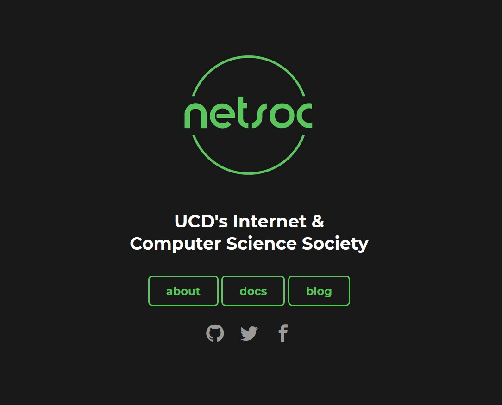

# UCD Netsoc Homepage
<!-- ALL-CONTRIBUTORS-BADGE:START - Do not remove or modify this section -->

<!-- ALL-CONTRIBUTORS-BADGE:END -->

Jekyll files for Netsoc homepage.

## Contributors ✨

Thanks goes to these wonderful people ([emoji key](https://allcontributors.org/docs/en/emoji-key)):

<!-- ALL-CONTRIBUTORS-LIST:START - Do not remove or modify this section -->
<!-- prettier-ignore-start -->
<!-- markdownlint-disable -->
<table>
  <tr>
    <td align="center"><a href="https://oisin.io"> <b>Oisín Quinn</b></a> <a href="#infra-oisinq" title="Infrastructure (Hosting, Build-Tools, etc)">🚇</a> <a href="https://github.com/ucdnetsoc/homepage/issues?q=author%3Aoisinq" title="Bug reports">🐛</a> <a href="#content-oisinq" title="Content">🖋</a> <a href="https://github.com/ucdnetsoc/homepage/commits?author=oisinq" title="Code">💻</a></td>
    <td align="center"><a href="http://www.linkedin.com/in/rajitbanerjee"> <b>Rajit Banerjee</b></a> <a href="https://github.com/ucdnetsoc/homepage/commits?author=rajitbanerjee" title="Code">💻</a> <a href="#content-rajitbanerjee" title="Content">🖋</a></td>
    <td align="center"><a href="http://ash.xyz"> <b>Ashraf Ali</b></a> <a href="#content-ash-xyz" title="Content">🖋</a></td>
  </tr>
</table>

<!-- markdownlint-enable -->
<!-- prettier-ignore-end -->
<!-- ALL-CONTRIBUTORS-LIST:END -->

This project follows the [all-contributors](https://github.com/all-contributors/all-contributors) specification. Contributions of any kind welcome!